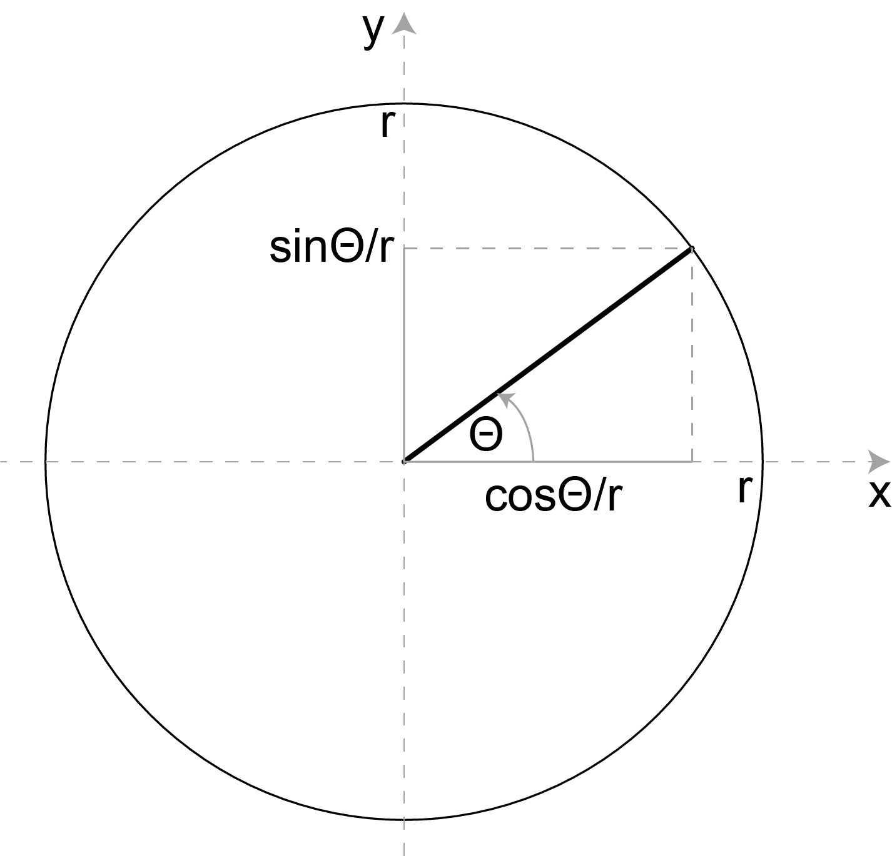
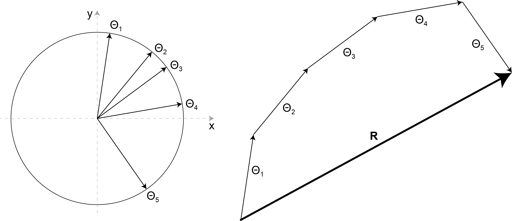

```{r setup, include=FALSE}
knitr::opts_chunk$set(echo = FALSE)

library(tectonicr)
library(dplyr)
library(ggplot2)
library(patchwork)
```

Why matter?

-   Angular data are periodical, linear data are not.
-   Angular data are distributed along a circle
    $\theta \subset \mathbb{R}, 0 \leq \theta \leq 2\pi]$ -- linear data
    are distributed along a line
    $x \subset \mathbb{R}, -\infty \leq x \leq \infty$
-   requires different mathematics to describe the distribution (e.g.
    mean and variance):

> Angles can be expressed either in radians or degrees
> $1\,\text{rad} = 1^{\circ} \times \frac{\pi}{180^{\circ}}$

```{r, echo = TRUE}
x <- c(1, 359)

mean(x)
sd(x)
```

#### Angles to Vectors



Using trigonometry functions:

\begin{align*}
x &= \cos{\theta}  / r \\
y &= \sin{\theta} / r
\end{align*} we get the rectangular coordinates of the vector in the
circle of radius $r$ represented by the angle $\theta$. For
simplification, $r = 1$.

#### Mean Direction

The mean direction \bar{\theta} of a set of angles
$\theta_1, ..., \theta_n$ is given by the resultant vector $R$ spanned
by all the vectors.



Coordinates of resultant vector $R$: \begin{align*}
x_R &= \sum_{i=1}^{n} \cos{\theta_i} \\
y_R &= \sum_{i=1}^{n} \sin{\theta_i}
\end{align*}

with $n$ being the number of angles.

Using trigonometry functions: $$\tan{\bar{\theta}} = \frac{y_R}{x_R}$$

#### Variance

Variance is expressed by the length of the mean resultant vector $R$:

Using theorem of Pythagoras: $$R = \sqrt{x_R^2 + y_R^2}$$

Length of R depends on **variance** of $\theta_i$ and the number of
angles $n$. Thus, we "normalize" $R$ by $n$:

$$\bar{R} = \frac{R}{n} = \sqrt{\bar{x_R}^2 + \bar{y_R}^2}$$

$\bar{R}$ has length = 1, when all angles $\theta_i$ are equal, and
length = 0 when, the angle are randomly distributed (along the
circumference of the circle). Thus, the variance of the angles is:

$$\sigma^2  = 1 - \bar{R}$$

The standard deviation is: $$
\sigma = \sqrt{-2  \log{(1-\sigma^2)}} = \sqrt{-2  \log{\bar{R}}}
$$

```{r, echo = TRUE}
circular_mean(x, axial = FALSE)
circular_sd(x, axial = FALSE)
```

### Dispersion from an expected value

The "distance" measurement for two given angles $\theta$ and $\xi$ is
the angular distance d:

$$ d(\theta, \xi) = 1 - \cos{\theta - \xi}$$ The dispersion of angles
$\theta_1, ..., \theta_n$ about a given angle $\alpha$ is:

$$D(\alpha) = \frac{1}{n} \sum_{i=1}^{n} d(\theta_i, \alpha)$$

```{r dispersion, echo = TRUE}
theta <- rvm(1000, mean = 45, kappa = 10) # sample from von Mises distribution
circular_dispersion(theta, 45)
```

> Note that $D(\bar{\theta}) = \sigma^2$

### Normal distribution

#### (Linear) normal distribution: $f(x | \mu, \sigma)$

```{r normal, echo = TRUE}
x <- rnorm(1000, mean = 0, sd = 1) # sample from normal distribution
hist(x, prob = TRUE)
lines(density(x), col = "red")
```

```{r}
mean(x)
sd(x)
```

#### Circular normal distribution ("von Mises Distribution"): $f(\theta | \mu, \kappa)$

$\kappa$ is the concentration parameter, ($\kappa > 0$, low values =
random, high values = high concentration). Thus,
$\frac{1}{kappa} \sim \sigma^2$.

```{r vonmises, echo = TRUE}
cols <- hcl.colors(6)
names(cols) <- as.character(c(.1, .5, 1, 2, 4, 8))

theta <- rvm(1000, mean = 180, kappa = 0.1) - 180 # sample from von Mises distribution
plot(theta, dvm(theta, mean = 0, kappa = 8), type = "p", col = cols[as.character(8)])

for (k in c(4, 2, 1, 0.5)) {
  theta <- rvm(1000, mean = 180, kappa = k) - 180 # sample from von Mises distribution
  lines(theta, dvm(theta, mean = 0, kappa = k), type = "p", col = cols[as.character(k)])
}
```

Better as rose diagram:

```{r vm_roses, echo = TRUE}
par(mfrow = c(2, 3))
for (k in c(0.1, .5, 1, 2, 4, 8)) {
  rose(rvm(1000, mean = 0, kappa = k), main = paste("k =", k), col = cols[as.character(k)], axial = FALSE)
}
```

The parameter $\kappa$ is difficult to measure directly, but the
concentration of the sample can be estimated from $\bar{R}$ (MLE).
`tectonicr:::est.kappa()` estimates the parameter $\hat{kappa$} from the
sample:

```{r kappa, echo = TRUE}
theta <- rvm(100, mean = 0, kappa = 10)
tectonicr:::est.kappa(theta)
```

## Test for uniformity

The so-called Rayleigh Test checks if the data is randomly distributed
or not. The Null Hypothesis is

$H_0$: $p = 0$ (i.e. the population is uniformly (randomly) distributed
around the circle)

When $H_0$ is rejected, the alternative hypothesis is

$H_A$: $p \neq 0$ (i.e. the population is not uniformly (randomly)
distributed around the circle. Thus, there is a preferred orientation.)

```{r rayleigh, echo = TRUE}
rayleigh_test(theta, axial = FALSE)
```

### Confidence interval of the mean direction

Confidence intervals for the mean can be obtained in the usual way from
$$\theta \pm \frac{z_\alpha / 2}{\sqrt{\hat{\kappa}R}}$$

$\hat{\kappa}$ is the maximum likelihood estimate of $\kappa$. $z_alpha$
denotes the upper quantile of linear normal distribution. This is
appropriate for $\hat{\kappa} \geq 2$ or $n\geq 10$ (Mardia and Jupp,
20000.)

```{r confidence, echo = TRUE}
confidence_interval(theta, conf.level = 0.95, axial = FALSE)
```

### Note on axial data

Axial data only range between 0 and 180$^{\circ}$ (or 0 and $\pi/2$). In
order, to use the same measurements as for orientation data, one doubles
the angles, calculates the mean, and eventually divides the result by 2.

## Exercises

### Bird homing

In a pidgeon-homing experiment by Schmidt-Koening (1963), the vanishing
angles of 15 birds were:

```{r pidgeon, echo=TRUE}
pidgeon <- c(85, 135, 135, 140, 145, 150, 150, 150, 160, 185, 200, 210, 220, 225, 270)
```

-   Axial or directional data?
-   Mean orientation?
-   Normally distributed?
-   Homing direction was 149$^{\circ}$. Is there a preferred homing
    direction (at 5% significance level)?

### Glacier stria in Finland

Glacier stria from Finland (Davis ,1986, pp. 316)

```{r stria, echo=TRUE}
finland_stria <- c(
  23, 27, 53, 58, 64, 83, 85, 88, 93, 99, 100, 105, 113,
  113, 114, 117, 121, 123, 125, 126, 126, 126, 127, 127, 128, 128, 129, 132,
  132, 132, 134, 135, 137, 144, 145, 145, 146, 153, 155, 155, 155, 157, 163,
  165, 171, 172, 179, 181, 186, 190, 212
)
```

-   Axial or directional data?
-   Mean orientation?
-   Normally distributed?
-   A todays location of a glacier is at 130$^{\circ}$ compass bearing.
    Does the stria origin from this glacier?
